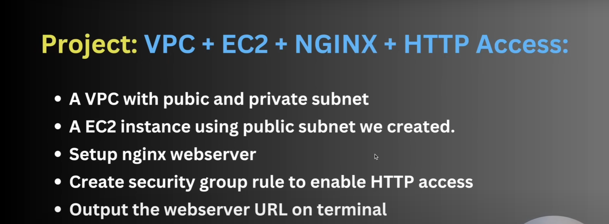

# Terraform EC2 Instance with Nginx Setup on AWS

## Overview

This Terraform project provisions a **custom VPC**, **subnets**, **internet access**, and an **EC2 instance** running **Nginx** on Amazon Linux 2. It's designed to help host a lightweight web server accessible via a browser.

## Key Points to Remember:

### 1. **VPC and Subnet Setup**
- A **custom VPC** with CIDR block `10.0.0.0/16` is created.
- Two subnets:
  - **Private Subnet** (`10.0.1.0/24`) for internal resources.
  - **Public Subnet** (`10.0.2.0/24`) with `map_public_ip_on_launch = true` to assign public IPs automatically.

### 2. **Internet Gateway and Routing**
- An **Internet Gateway** is created and attached to the VPC.
- A **Route Table** is configured to route traffic to the internet via the IGW.
- The **Route Table** is explicitly associated with the **Public Subnet**.

### 3. **Security Group for Nginx**
- A **Security Group (`nginx-sg`)** is created to:
  - Allow **HTTP (port 80)** access from anywhere (`0.0.0.0/0`).
  - Allow **all outbound traffic** using protocol `-1`.

### 4. **EC2 Instance Setup**
- EC2 instance runs **Amazon Linux 2** (AMI ID: `ami-00a929b66ed6e0de6`).
- Uses **`t2.micro`** (free-tier eligible).
- Launched in the **public subnet** with a public IP.
- **User Data script** installs and starts **Nginx** automatically:
  ```bash
  #!/bin/bash
  sudo yum install nginx -y
  sudo systemctl start nginx
