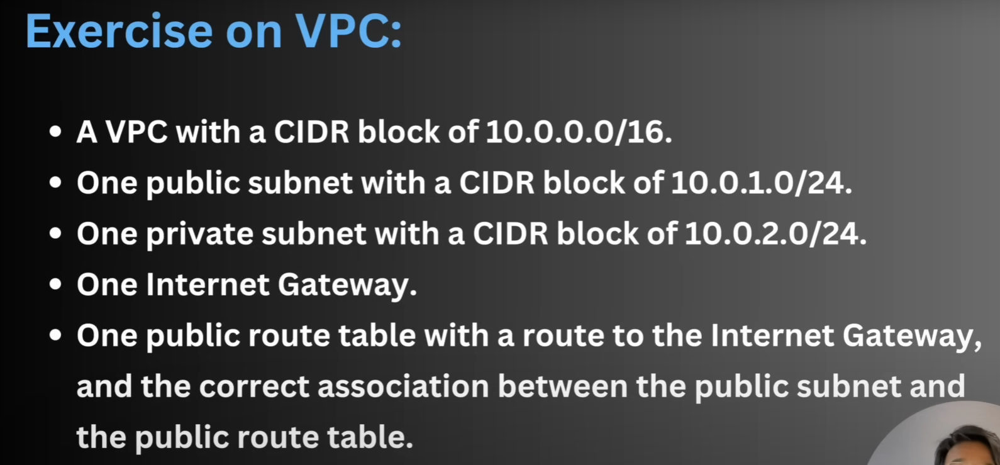

# ☁️ AWS VPC + EC2 Setup with Terraform

🔵 Exercise on VPC:

• A VPC with a CIDR block of 10.0.0.0/16.
• One public subnet with a CIDR block of 10.0.1.0/24.
• One private subnet with a CIDR block of 10.0.2.0/24.
• One Internet Gateway.
• One public route table with a route to the Internet Gateway, and the correct association between the public subnet and the public route table.

## 🧠 Project Overview

This setup creates a custom Virtual Private Cloud (VPC) in AWS using Terraform. The project is designed to help understand and practice networking concepts in AWS such as subnets, internet gateways, route tables, and launching an EC2 instance inside a VPC.

---

## 🔧 What this Terraform config does

- **Creates a custom VPC**  
  A virtual network (CIDR: `10.0.0.0/16`) to isolate AWS resources.

- **Defines two subnets**  
  - **Private Subnet**: CIDR `10.0.1.0/24`, for backend or internal components (not used right now).
  - **Public Subnet**: CIDR `10.0.2.0/24`, where the EC2 instance lives. Configured to assign public IPs on launch.

- **Creates an Internet Gateway (IGW)**  
  Required to allow internet access to instances in the public subnet.

- **Adds a Route Table**  
  - Routes all outbound traffic (`0.0.0.0/0`) from the public subnet to the internet via IGW.
  - Associates this route table with the public subnet.

- **Launches an EC2 instance in the public subnet**  
  - A `t2.micro` instance using a given AMI.
  - Tags it as `SampleSERVER`.

---

## 📌 Key Concepts to Remember

- **VPC**: Think of this as your own private data center in the cloud.
- **Subnets**: Divide your VPC — public ones for internet-facing apps, private ones for internal services.
- **Internet Gateway**: Enables your resources in the VPC to access the internet.
- **Route Table**: Controls how traffic is routed within your VPC.
- **Public IP Assignment**: `map_public_ip_on_launch = true` must be set for EC2 in public subnets.
- **Security Groups & Key Pair**: Not included here, but essential for SSH access and controlling traffic.

---

## 🚨 Gotchas to Avoid

- Without a **security group**, you won't be able to SSH or send traffic to your EC2.
- Make sure your **AMI ID** is valid for your AWS region (`us-east-1` here).
- Don’t forget to clean up (`terraform destroy`) when done to avoid unexpected charges.

---

